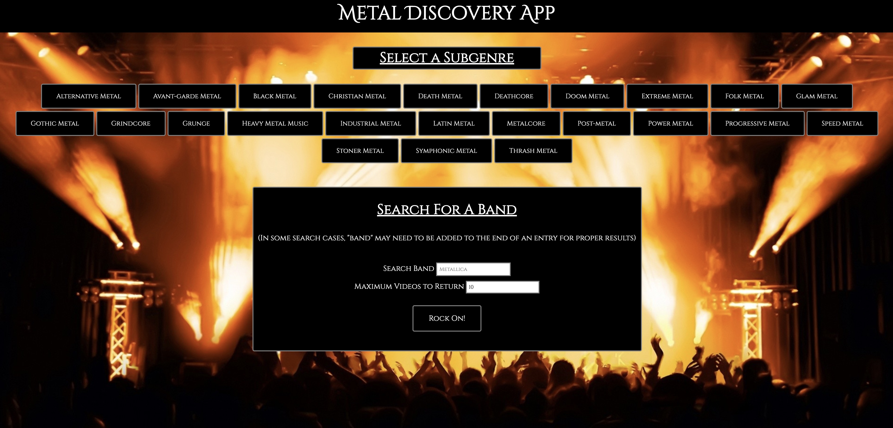
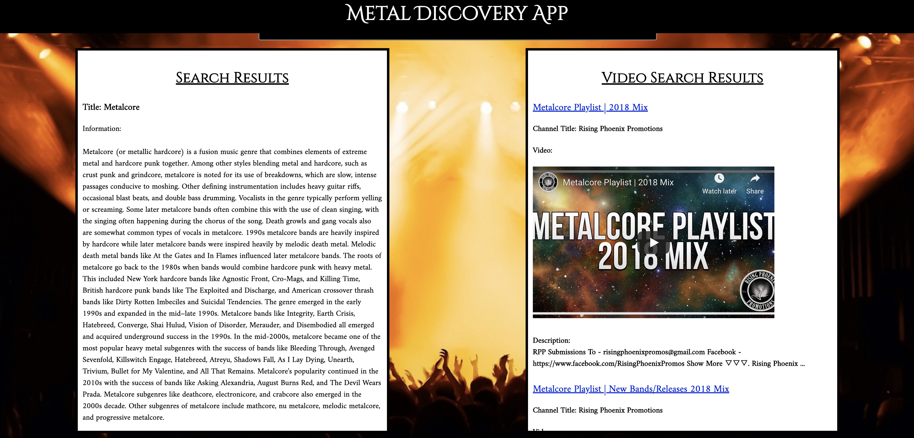
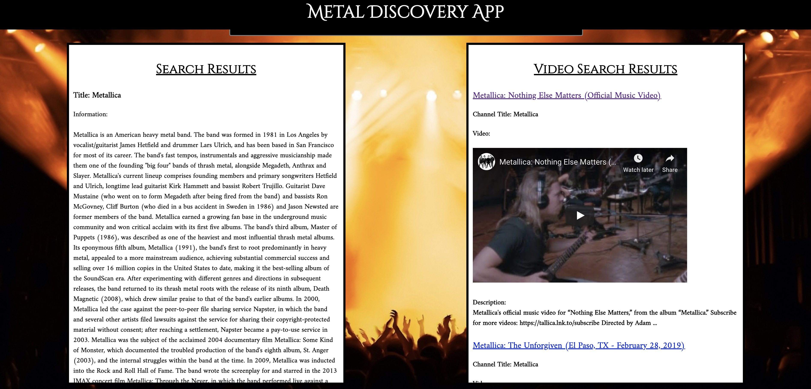

# Metal Discovery App

API Capstone for a Metal music sub-genre discovery application

## The Idea

The idea behind this application was to create a way for users to broaden their taste in metal music or to learn about a
specific subgenre that they have never really listened to. The user has two options, the first option is the user can select 
a subgenre and receive information on the selected subgenre and playlists from YouTube to get a sample of how it sounds. 
The second option is to search for a specific band, by doing so, the user receives information on the searched band and the 
videos from YouTube to listen to their music. 

## Working Link

[Metal Discovery App](https://tylerfreebs.github.io/metal-api-capstone/)

## Images of the Application

Application Start Screen:

Genre Search Results:

Band Search Results:

## Technolgies Used

* HTML
* CSS
* JavaScript
* jQuery
